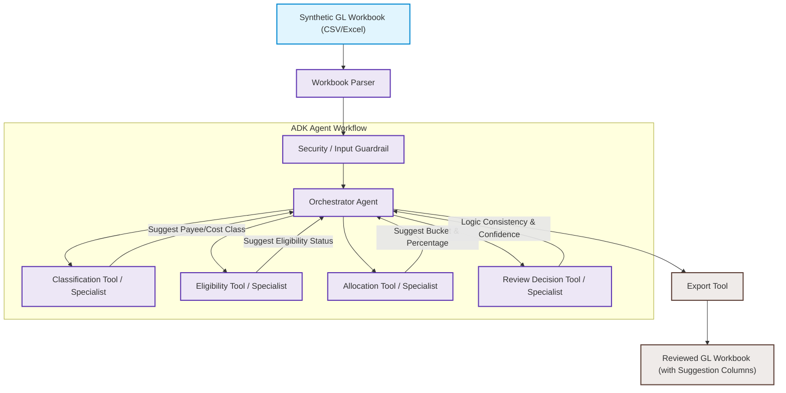

# BOC Allocation Review Agent (Kaggle Capstone)

A local-first, ADK-compatible AI Agent co-pilot designed to assist production accountants in the Canadian film and television industry. This agent processes a synthetic, pre-cleaned/enriched General Ledger (GL) workbook and suggests Breakdown of Costs (BOC) allocation treatments. The output is a BOC allocation review workbook, not an official filing.

> [!IMPORTANT]
> **Project Scope Boundaries**:
> * This project is a **focused AI Agent MVP** designed to suggest allocations; it is **NOT** a generic tax-credit automation platform or a full production accounting system.
> * It does **NOT** query real databases (citizenship, residency, payroll, ERP, or corporate registries) and does **NOT** compile official tax forms (like CAVCO Form 6). Form 6 generation is completely out of scope.
> * The agent assists human accountants by suggesting likely treatments and flagging missing or conflicting evidence; the output is a BOC allocation review workbook, not an official filing.

---

## 📖 Table of Contents
- [Project Overview & Goals](#-project-overview--goals)
- [Problem Statement](#-problem-statement)
- [Architecture & Data Flow](#-architecture--data-flow)
- [MVP Scope Definition](#-mvp-scope-definition)
- [Evaluation Plan & Performance Metrics](#-evaluation-plan--performance-metrics)
- [Local Quickstart & Demo](#-local-quickstart--demo)
- [Future Improvements](#-future-improvements)

---

## 🎯 Project Overview & Goals

Canadian film and television productions rely heavily on tax credits to cover portions of their budgets. Suggesting the proper tax credit allocations requires reviewing general ledger exports against complex mapping guidelines.

The **BOC Allocation Review Agent** processes a synthetic, pre-cleaned/enriched GL workbook (containing approximately 190+ fictional transactions) and adds agent-generated review fields to the output workbook:
1. **Suggested Allocation Column**: Mapping transactions to one of 20 distinct allocation categories (Ontario, Federal, and minimal Quebec support).
2. **Amount Percentage**: The portion of the transaction amount that should be allocated or claimed in the suggested bucket (represented on a 0.0 to 100.0 scale, e.g., 100.0 for standard salary, 65.0 for certain multi-share labor).
3. **Eligibility Status**: Suggested eligibility status based on synthetic mapping rules and available workbook fields.
4. **Confidence Score**: Quantitative metric reflecting the classification reliability.
5. **Review Status**: Marked as `Needs Human Review` if confidence is below threshold, required fields are missing, or special review flags are triggered; otherwise marked as `Approved` for the MVP ledger.
6. **Reasoning**: A clear explanation of the agent's suggested treatment based on available fields.
7. **Reference Rule**: Citations matching synthetic policy documents and rules.
8. **Secondary Allocation Note**: Detailed splits or remaining treatment notes (e.g., for multi-share/fringe splits).

For a detailed review, see [docs/problem_statement.md](file:///f:/Studyspace/AI_Agents_5_Day_Google/capstone/docs/problem_statement.md).

---

## ⚠️ Problem Statement

Production accountants manually audit spreadsheets containing thousands of GL entries, cross-referencing residency assumptions and cost codes to build tax claims. Mistakes can lead to under-claiming credits (lost financing) or over-claiming ineligible expenses (resulting in CRA audits, penalties, and delayed financing).

The **BOC Allocation Review Agent** acts as an automated validation assistant. By analyzing workbook details, applying simulated rules, and flagging transactions with missing details or complex rules, it streamlines the preparation phase and routes ambiguous records to human professionals.

---

## 🏗️ Architecture & Data Flow

The system is implemented as a local-first, ADK-compatible agent workflow that reads a synthetic GL ledger and exports a reviewed workbook containing suggested allocations.



For full details of each tool and state manager variables, see [docs/architecture.md](file:///f:/Studyspace/AI_Agents_5_Day_Google/capstone/docs/architecture.md).

---

## 🎯 MVP Scope Definition

The scope of this project is tailored for a solo, two-week capstone MVP cycle, focusing on demonstrating core AI agent reasoning, local evaluation, and security sanitization.

### In Scope
- Reading synthetic Excel/CSV GL workbooks.
- Row normalization and pre-routing PII/input validation checks.
- Suggesting 20 target allocation buckets (including specialized provincial/federal VICE Canada and Quebec columns).
- Suggesting amount percentages, eligibility statuses, and secondary notes.
- Flagging ambiguous rows directly in the exported output (`Review Status = Needs Human Review`).
- Running batch evaluations against a manually labeled ground-truth sample.

### Out of Scope
- Direct integrations with live production accounting ERPs (PSL, Ease, Cast & Crew).
- OCR engines for paper receipts/invoices.
- Live database queries to real citizenship, residency, or corporate registries.
- Generating final CAVCO Form 6 PDF files (Form 6 generation is out of scope).
- Full multi-user web dashboards and live cloud deployments.

See [docs/mvp_scope.md](file:///f:/Studyspace/AI_Agents_5_Day_Google/capstone/docs/mvp_scope.md) for detailed boundaries.

---

## 📊 Evaluation Plan & Performance Metrics

The agent is evaluated locally using a manually labeled subset of the synthetic GL workbook.

### Key Metrics
* **Allocation Column Accuracy**: Rate of matching the expected tax allocation column.
* **Eligibility Status Accuracy**: Correctly classifying transaction eligibility status.
* **Review Flag Recall**: Rate of flagging rows with missing required fields or special review categories for human review.
* **Ineligible Leakage Rate**: The rate at which actual ineligible costs are accidentally approved without review.
* **Special Case Accuracy**: Classification performance on VICE Canada, Partnership vendors, Meal/Catering, and Multi-share percentage allocations.

Read the full evaluation metrics and validation workflow in [docs/evaluation_plan.md](file:///f:/Studyspace/AI_Agents_5_Day_Google/capstone/docs/evaluation_plan.md).

---

## 🚀 Local Quickstart & Demo

### 1. Installation
Ensure you have `uv` installed, then synchronize the environment:
```bash
uv sync
```

### 2. Configure Environment
Create a `.env` file in the root directory:
```env
GEMINI_API_KEY=your_gemini_api_key
```

### 3. Run the Local Processing
Run the agent over the synthetic ledger workbook:
```bash
uv run python -m boc_agent.cli --input data/synthetic/synthetic_boc_gl_dataset.xlsx --output outputs/reviewed_boc_gl_dataset.xlsx
```

### 4. Run the Evaluation Harness
Execute unit and accuracy tests:
```bash
uv run pytest
```

---

## 🔮 Future Improvements

1. **ADK Stateful Interrupts**: Integrate `RequestInput` and Vertex AI Session Service for real-time interactive human approval.
2. **Multi-Province Expansion**: Implement additional rule specialist modules for British Columbia (FIBC) and Quebec (SODEC).
3. **Form 6 Mapping**: Export audited ledger categories into templates matching CAVCO's Schedule of Production Costs layout.
