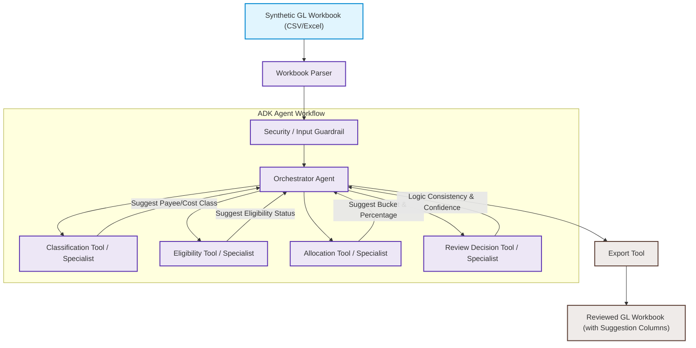

# BOC Allocation Review Agent (Kaggle Capstone)

A local-first, ADK-compatible AI Agent co-pilot designed to assist production accountants in the Canadian film and television industry. This agent processes a synthetic, pre-cleaned/enriched General Ledger (GL) workbook and suggests Breakdown of Costs (BOC) allocation treatments. The output is a BOC allocation review workbook, not an official filing.

> [!IMPORTANT]
> **Project Scope Boundaries**:
> * This project is a **focused AI Agent MVP** designed to suggest allocations; it is **NOT** a generic tax-credit automation platform or a full production accounting system.
> * It does **NOT** query real databases (citizenship, residency, payroll, ERP, or corporate registries) and does **NOT** compile official tax forms (like CAVCO Form 6). Form 6 generation is completely out of scope.
> * The agent assists human accountants by suggesting likely treatments and flagging missing or conflicting evidence; the output is a BOC allocation review workbook, not an official filing.

---

## 📖 Table of Contents
- [Project Overview & Goals](#-project-overview--goals)
- [Problem Statement](#-problem-statement)
- [Architecture & Data Flow](#-architecture--data-flow)
- [MVP Scope Definition](#-mvp-scope-definition)
- [Evaluation Plan & Performance Metrics](#-evaluation-plan--performance-metrics)
- [Local Quickstart & Demo](#-local-quickstart--demo)
- [Conversational Review Assistant (Phase 8.1)](#-conversational-review-assistant-phase-81)
- [Future Improvements](#-future-improvements)

---

## 🎯 Project Overview & Goals

Canadian film and television productions rely heavily on tax credits to cover portions of their budgets. Suggesting the proper tax credit allocations requires reviewing general ledger exports against complex mapping guidelines.

### 💼 Business Value Proposition
By automating the preliminary auditing and sorting of General Ledger entries, the **BOC Allocation Review Agent**:
- **Reduces Compliance Risk**: Lowers ineligible claim leakage through a conservative, deterministic rules engine.
- **Saves Accounting Hours**: Pre-populates obvious claims (such as in-province salary or local supplies) and groups them by creates bodies (Ontario or Quebec SODEC), allowing accountants to focus exclusively on items requiring manual intervention.
- **Review Support**: Automatically flags fallback treatment opportunities (such as Federal fallback for inter-provincial payees) to help reviewers identify potentially eligible expenses and rows requiring follow-up.

### ⚙️ Rule-Engine-First Design
The project uses a local-first, **rules-first** architecture. A deterministic Canadian production accounting rules engine remains the final source of truth. The AI/ADK agent orchestration wraps around this engine to provide input security scanning, metadata extraction, structural tracing, and packaging without overriding or modifying the validated accounting rules.

For a detailed review, see [docs/problem_statement.md](docs/problem_statement.md).

---

## ⚠️ Problem Statement

Production accountants manually audit spreadsheets containing thousands of GL entries, cross-referencing residency assumptions and cost codes to build tax claims. Mistakes can lead to under-claiming credits (lost financing) or over-claiming ineligible expenses (resulting in CRA audits, penalties, and delayed financing).

The **BOC Allocation Review Agent** acts as an automated validation assistant. By analyzing workbook details, applying simulated rules, and flagging transactions with missing details or complex rules, it streamlines the preparation phase and routes ambiguous records to human professionals.

---

## 🏗️ Architecture & Data Flow

The system is implemented as a local-first, ADK-compatible agent workflow that reads a synthetic GL ledger and exports a reviewed workbook containing suggested allocations.



For full details of each tool and state manager variables, see [docs/architecture.md](docs/architecture.md).

---

## 🎯 MVP Scope Definition

The scope of this project is tailored for a solo, two-week capstone MVP cycle, focusing on demonstrating core AI agent reasoning, local evaluation, and security sanitization.

### In Scope
- Reading synthetic Excel/CSV GL workbooks.
- Row normalization and pre-routing PII/input validation checks.
- Suggesting 20 target allocation buckets (including specialized provincial/federal VICE Canada and Quebec columns).
- Suggesting amount percentages, eligibility statuses, and secondary notes.
- Flagging ambiguous rows directly in the exported output (`Review Status = Needs Human Review`).
- Running batch evaluations against a manually labeled ground-truth sample.

### Out of Scope
- Direct integrations with live production accounting ERPs (PSL, Ease, Cast & Crew).
- OCR engines for paper receipts/invoices.
- Live database queries to real citizenship, residency, or corporate registries.
- Generating final CAVCO Form 6 PDF files (Form 6 generation is out of scope).
- Full multi-user web dashboards and live cloud deployments.

See [docs/mvp_scope.md](docs/mvp_scope.md) for detailed boundaries.

---

## 📊 Evaluation Plan & Performance Metrics

The agent is evaluated locally using a manually labeled subset of the synthetic GL workbook.

### Key Metrics
* **Allocation Column Accuracy**: Rate of matching the expected tax allocation column.
* **Eligibility Status Accuracy**: Correctly classifying transaction eligibility status.
* **Review Flag Recall**: Rate of flagging rows with missing required fields or special review categories for human review.
* **Ineligible Leakage Rate**: The rate at which actual ineligible costs are accidentally approved without review.
* **Special Case Accuracy**: Classification performance on VICE Canada, Partnership vendors, Meal/Catering, and Multi-share percentage allocations.

Read the full evaluation metrics and validation workflow in [docs/evaluation_plan.md](docs/evaluation_plan.md).

---

## 🚀 Local Quickstart & Demo

### 1. Installation
Ensure you have `uv` installed, then synchronize the environment:
```bash
uv sync
```

### 2. Configure Environment
Create a `.env` file in the root directory:
```env
GEMINI_API_KEY=your_gemini_api_key
```

### 3. Run the Local Processing
Run the agent over the synthetic ledger workbook:
```bash
uv run python -m boc_agent.cli --input data/synthetic/synthetic_boc_gl_dataset.xlsx --output outputs/reviewed_boc_gl_dataset.xlsx
```

### 4. Run the Streamlit Dashboard
Launch the interactive audit dashboard for capstone review:
```bash
uv run streamlit run app.py
```

### 5. Run the Evaluation Harness
Execute all unit, integration, and UI helper tests (87 tests total):
```bash
uv run pytest
```

### 6. Run the Evaluation Summary
Calculate workbook statistics (total rows, status distribution, and highlights):
```bash
uv run python scripts/evaluate_outputs.py outputs/reviewed_boc_gl_dataset.xlsx
```

### 7. Run the HITL Queue Builder
Extract transactions requiring manual review into a separate queue spreadsheet:
```bash
uv run python scripts/build_review_queue.py outputs/reviewed_boc_gl_dataset.xlsx outputs/human_review_queue.xlsx
```

---

## 💬 Conversational Review Assistant & Local RAG (Phase 8.1 & 8.2)

An interactive, local-first conversational review co-pilot is integrated directly into the Streamlit dashboard as a dedicated tab.

* **Deterministic Q&A**: Employs keyword-based query routing grounded strictly within the reviewed workbook data for transaction queries (Phase 8.1).
* **Local Documentation RAG**: Answers general policy, setup, and workflow questions (e.g. *“What is Location 920?”*, *“Explain the HITL process”*) using a local TF-IDF retrieval index built on repository documents (Phase 8.2).
* **No LLMs / No API Calls**: Synthesizes responses by formatting matching document chunks directly into templates. It makes no external LLM API calls, no network requests, and has no cloud dependencies.
* **In-Memory Store**: Uses an in-memory index loaded lazily during application startup or tests.
* **Read-Only / No Mutation**: Ensures that querying never mutates the underlying general ledger records, suggestions, or human decisions.
* **Header Compatibility**: Supports queries using original Excel workbook headers (`Trans Ref`, `Vendor Name`) as well as internal `snake_case` attributes.
* **No Official Rulings**: Built with disclaimer safety guardrails to refuse requests requesting official tax, CRA, CAVCO, SODEC, or legal determinations, redirecting accountants to qualified specialists.

---

## 🛑 Known MVP Limitations
* **No Live Verification**: Does not query live databases (CRA, CAVCO, Ontario Creates, corporate/residency registries).
* **Minimal Quebec Context**: Includes minimal MVP SODEC Quebec buckets only. Advanced regional or special SODEC credits are out of scope.
* **Hardcoded Multi-share Rules**: Multi-share creative labor uses fixed 65%/35% split caps based on internal synthetic workbook conventions and MVP assumptions, not universal statutory treatment.
* **No Form 6 Compile**: Suggests workbook allocation columns; does not compile official CAVCO Form 6 PDF applications.

---

## 🔮 Future Improvements

1. **ADK Stateful Interrupts**: Integrate `RequestInput` and Vertex AI Session Service for real-time interactive human approval.
2. **Multi-Province Expansion**: Implement additional rule specialist modules for British Columbia (FIBC) and Quebec (SODEC).
3. **Form 6 Mapping**: Export reviewed ledger categories into templates matching CAVCO's Schedule of Production Costs layout.
