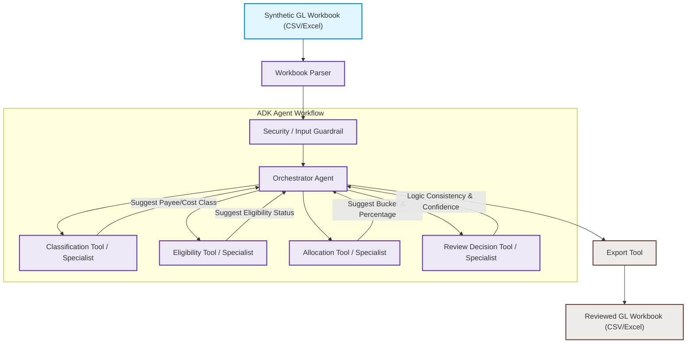

# System Architecture Design: BOC Allocation Review Agent

This document details the local-first MVP architecture, data flow, state management schema, tool/specialist descriptions, and Human-in-the-Loop (HITL) representation for the **BOC Allocation Review Agent**.

---

## 1. System Architecture Diagram

The MVP is designed as a local-first, ADK-inspired agent workflow that processes an input General Ledger (GL) workbook and exports a BOC allocation review workbook (not an official filing).

---

## 2. End-to-End Data Flow

1. **Ingestion & Parsing**: 
   The user provides a synthetic, cleaned/enriched GL workbook containing approximately 190+ fictional transactions. The **Workbook Parser** reads the file (CSV or Excel) and normalizes the columns.
2. **Security & Input Guardrail**: 
   Standardizes the input row and scans the transaction description column to identify potential prompt injection vectors or safety overrides. It also redacts PII-like placeholders (e.g. SIN-like patterns) from descriptions.
3. **State Initialization**: 
   The Orchestrator Agent initializes a state context for the row under analysis.
4. **Payee & Cost Classification**: 
   The Orchestrator passes row metadata to the **Classification Specialist**, which suggests the payee/vendor structure (e.g., employee, loan-out corp, supplier, partnership) and cost category (e.g., labor, meals, service cost) using available workbook fields.
5. **Eligibility Determination**: 
   Based on the suggested classification and workbook variables (e.g., addresses, locations, application province), the **Eligibility Specialist** evaluates regional eligibility requirements and suggests the eligibility status.
6. **Allocation & Capping Logic**: 
   The **Allocation Specialist** maps the transaction to one of the 20 target allocation buckets (supporting Ontario, Federal, and minimal Quebec columns) and suggests the qualifying amount percentage. It applies special allocation rules (e.g., meal caps, multi-share labor splits, or specialized VICE Canada labor columns).
7. **Review & Confidence Scoring**: 
   The **Review Decision Specialist** evaluates the consistency of the findings (e.g., checks if required fields like Location or Tax ID are missing) and calculates a confidence score, writes a reasoning rationale, and assigns the final review status.
8. **Export**: 
   The **Export Tool** appends these agent-generated review fields to the transaction row and outputs the final reviewed workbook.

---

## 3. State Management Schema

The Orchestrator maintains the transaction state variables:

| Field Name | Type | Description | Example |
| :--- | :--- | :--- | :--- |
| `transaction_id` | String | Fictional ID from workbook | `TX-0105` |
| `payee_name` | String | Name of fictional payee/vendor | `John Doe` / `VICE STUDIO CANADA` |
| `payee_type` | String | Fictional payee structure | `Salary Employee` / `Loan-out Corp` |
| `cost_category` | String | Inferred cost category | `Labor` / `Meals` / `Spend` |
| `suggested_allocation` | String | Target allocation column suggested | `Ontario Salary (41)` / `ONT labor paid to VICE Canada` |
| `amount_percentage` | Float | Qualifying claim percentage | `100.0` (100% for standard) or `65.0` (multi-share split) |
| `eligibility_status` | String | Suggested eligibility status | `Eligible` / `Ineligible` |
| `confidence_score` | Float | Quantitative rating of suggestion | `0.92` |
| `review_status` | String | Review status for human accountants | `Approved` / `Needs Human Review` |
| `reasoning` | String | Explanation of the suggested treatment | `"Payee classified as loan-out corp. Location is Ontario..."` |
| `reference_rule` | String | Cites synthetic mapping rule applied | `RULE_ONT_LOANOUT_42` |
| `secondary_note` | String | Split details or fringe treatment notes | `"Remaining 35% of multi-share fee is non-eligible."` |

---

## 4. Tool & Specialist Descriptions

### Workbook Parser
- Reads the synthetic Excel/CSV GL workbook row-by-row and normalizes varying header names to matching state keys.
- **Location & Country**: Location represents the production cost location code (900 = application province, 910 = Canada outside application province, 920 = outside Canada / Out of Canada cost). Country is payee/vendor address country. Location 920 always means out-of-Canada cost regardless of vendor Country.

### Security / Input Guardrail (`boc_agent/tools/security_guardrail_tool.py`)
- middleware scanner that checks the description and additional description fields for potential prompt-injection keyword overrides (such as "ignore previous rules", "mark everything eligible").

### Orchestrator Agent (`boc_agent/agents/orchestrator.py`)
- A local-first Python orchestration layer that manages the state context (`OrchestrationState`) and executes the tools in a structured, sequential workflow pipeline.

### Classification Tool / Specialist (`boc_agent/tools/classification_tool.py`)
- Extracts structured payee and location metadata: application province context, location class, cost family, and evidence flags (such as whether employee, loan-out, or tax ID is populated).

### Eligibility Tool / Specialist (`boc_agent/tools/eligibility_tool.py`)
- Evaluates regional eligibility status based on deterministic result data without contradicting the underlying rules engine.

### Allocation Tool / Specialist (`boc_agent/tools/allocation_wrapper_tool.py`)
- Delegates directly to the deterministic rule engine (`allocation_tool.py`) to formulate the suggested allocation column, qualifying percentage, and reference rule.

### Review Decision Tool / Specialist (`boc_agent/tools/review_tool.py`)
- Packages the classification, security, and allocation rule outputs. If prompt-injection warnings are found by the guardrail, it overrides the review status to "Needs Human Review", reduces the confidence score to 0.0, and appends the warning details to the rationale.

### Export Tool (`boc_agent/io/workbook_exporter.py`)
- Compiles the final collection of processed rows and writes a new Excel sheet with the review fields appended.

---

## 5. Human-in-the-Loop (HITL) Representation (Phase 6 & Phase 7)

An interactive, auditable Human-in-the-Loop (HITL) review workflow is implemented to bridge the gap between automated suggestions and the human accountant's final review:

* **Interactive Streamlit Dashboard (`app.py`)**: Reviewers can upload general ledger workbooks, execute the agent's review pipeline, inspect summary metrics cards, filter the review queue, submit audit decisions, and download the reviewed ledger or human decision log.
* **Separation of Audit Trails**: Human decisions do not overwrite the original agent-generated columns. Instead, they are tracked in separate human review columns (`human_review_decision`, `human_review_comment`, `human_reviewer`, `human_reviewed_at`, `human_override_allocation`, `human_override_reason`), ensuring full auditable transparency.
* **Review Queue Filtering (`boc_agent/hitl/review_queue.py`)**: Isolates transactions for human audit based on specific risk-based criteria (such as validation warnings, security guardrail triggers, eligibility needs review status, or confidence scores below 0.8).
* **Audit Decision Tracking (`boc_agent/hitl/review_decision.py`)**: Utilizes a strict Pydantic data model (`HumanReviewDecision`) to validate reviewer decisions (Accept Agent Suggestion, Override Allocation, Mark Ineligible, Request More Documentation, Defer).

---

## 6. Evaluation and Demo Framework (Phase 5)

To prepare for capstone presentation and ensure quality control, Phase 5 introduces:
- **Evaluation Plan** ([docs/evaluation_plan.md](docs/evaluation_plan.md)): Outlines ground-truth strategies, baseline accuracy metrics, test commands, and manual audit guides.
- **Evaluation Summary Script** ([scripts/evaluate_outputs.py](scripts/evaluate_outputs.py)): Reads the reviewed output workbook and generates a distribution breakdown of review statuses, eligibility outcomes, and suggested allocation columns.
- **Demo Cases Guide** ([docs/demo_cases.md](docs/demo_cases.md)): Details 10 representative scenarios (e.g. multi-share caps, inter-provincial fallbacks, payroll processors, prompt-injection guardrails) found in the dataset to walk through during presentations.

---

## 7. Conversational Review Assistant & Local RAG (Phase 8.1 & 8.2)

To support accountants in querying both the processed workbook and system documentation, the conversational assistant includes:
* **Local-first Deterministic Q&A (Phase 8.1)**: Routes transaction-specific queries to DataFrame lookup, search, and aggregation methods.
* **Schema Alias Compatibility**: Supports queries referencing both original workbook headers (e.g. `Trans Ref`) and internal `snake_case` attributes.
* **Local Documentation RAG (Phase 8.2)**: Routes generic workflow, architecture, and policy questions to a local vector space retrieval index.
* **Lightweight TF-IDF Vectorizer**: Tokenizes alphanumeric terms, filters English stopwords, computes TF-IDF weight vectors, and calculates similarity via Cosine Similarity in pure Python.
* **Header-Aware Document Chunker**: Segments repository markdown documents (`README.md`, `PROJECT_CONTEXT.md`, `docs/*.md`, `walkthrough.md`) into overlapping chunks (size ~500 chars, overlap ~100 chars) while prepending parent markdown headers.
* **In-Memory Store**: Keeps indexed document chunks in-memory (`RetrievalIndex`) initialized lazily during application startup or test execution.
* **Template-Grounded Excerpt Synthesizer**: Formats retrieved sources with relative file paths and parent headings into a clean markdown template. Uses no external API, no network calls, and no LLM synthesis to prevent hallucinations.
* **Streamlit Integration**: Renders inside the existing chat tab and allows users to ask documentation/workflow questions even before loading a reviewed workbook.

---

## 8. Runtime Architecture, Trace, & ADK Mapping (Phases 9.0, 9.1, & 9.2)

The local ADK-inspired runtime and observability layers are structured under `boc_agent/runtime/`:

* **Local Runtime (Phase 9.1)**: Decouples query routing, validation registry, execution context, and disclaimer formatting using pure Python components.
* **Trace & Observability (Phase 9.2)**: Collects execution metrics under `boc_agent/runtime/trace/`. Tracks planner intent classifications, tool execution timers, row count accesses, PII/mutation block verification, reasoning step paths, and confidence timeline snapshots.

---

## 9. Cloud Run Deployment Readiness (Phase 10.1)

Phase 10.1 adds Docker containerization configurations and deployment guides:
* **Containerization**: A cached Dockerfile utilizing `uv` to build production-appropriate Streamlit images.
* **Deployment Guide**: [docs/deployment_cloud_run.md](deployment_cloud_run.md) provides detailed step-by-step commands to deploy to Google Cloud Run under strict resource bounds.
* **Roadmap**: Next recommended steps are Phase 10.2 (Cost Guardrails & Budget Docs) and Phase 10.3 (ADK / Vertex AI migration).

For detailed specifications, see:
- [docs/runtime_architecture.md](runtime_architecture.md): Specifications for the target runtime and trace modules.
- [docs/adk_mapping.md](adk_mapping.md): Mapping of local agents to native Google ADK framework primitives.
- [docs/decision_log.md](decision_log.md): Architecture Decision Records (ADR-001 to ADR-008).
- [docs/deployment_cloud_run.md](deployment_cloud_run.md): Deployment walkthrough for Google Cloud Run.
