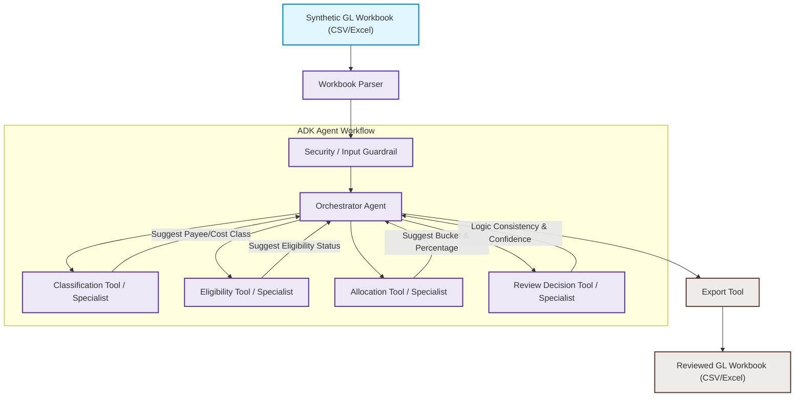

# System Architecture Design: BOC Allocation Review Agent

This document details the local-first MVP architecture, data flow, state management schema, tool/specialist descriptions, and Human-in-the-Loop (HITL) representation for the **BOC Allocation Review Agent**.

---

## 1. System Architecture Diagram

The MVP is designed as a local-first, ADK-compatible agent workflow that processes an input General Ledger (GL) workbook and exports a BOC allocation review workbook (not an official filing).

---

## 2. End-to-End Data Flow

1. **Ingestion & Parsing**: 
   The user provides a synthetic, cleaned/enriched GL workbook containing approximately 190+ fictional transactions. The **Workbook Parser** reads the file (CSV or Excel) and normalizes the columns.
2. **Security & Input Guardrail**: 
   Standardizes the input row and scans the transaction description column to identify potential prompt injection vectors or safety overrides. It also redacts PII-like placeholders (e.g. SIN-like patterns) from descriptions.
3. **State Initialization**: 
   The Orchestrator Agent initializes a state context for the row under analysis.
4. **Payee & Cost Classification**: 
   The Orchestrator passes row metadata to the **Classification Specialist**, which suggests the payee/vendor structure (e.g., employee, loan-out corp, supplier, partnership) and cost category (e.g., labor, meals, service cost) using available workbook fields.
5. **Eligibility Determination**: 
   Based on the suggested classification and workbook variables (e.g., addresses, locations, application province), the **Eligibility Specialist** evaluates regional eligibility requirements and suggests the eligibility status.
6. **Allocation & Capping Logic**: 
   The **Allocation Specialist** maps the transaction to one of the 20 target allocation buckets (supporting Ontario, Federal, and minimal Quebec columns) and suggests the qualifying amount percentage. It applies special allocation rules (e.g., meal caps, multi-share labor splits, or specialized VICE Canada labor columns).
7. **Review & Confidence Scoring**: 
   The **Review Decision Specialist** evaluates the consistency of the findings (e.g., checks if required fields like Location or Tax ID are missing) and calculates a confidence score, writes a reasoning rationale, and assigns the final review status.
8. **Export**: 
   The **Export Tool** appends these agent-generated review fields to the transaction row and outputs the final reviewed workbook.

---

## 3. State Management Schema

The Orchestrator maintains the transaction state variables:

| Field Name | Type | Description | Example |
| :--- | :--- | :--- | :--- |
| `transaction_id` | String | Fictional ID from workbook | `TX-0105` |
| `payee_name` | String | Name of fictional payee/vendor | `John Doe` / `VICE STUDIO CANADA` |
| `payee_type` | String | Fictional payee structure | `Salary Employee` / `Loan-out Corp` |
| `cost_category` | String | Inferred cost category | `Labor` / `Meals` / `Spend` |
| `suggested_allocation` | String | Target allocation column suggested | `Ontario Salary (41)` / `ONT labor paid to VICE Canada` |
| `amount_percentage` | Float | Qualifying claim percentage | `100.0` (100% for standard) or `65.0` (multi-share split) |
| `eligibility_status` | String | Suggested eligibility status | `Eligible` / `Ineligible` |
| `confidence_score` | Float | Quantitative rating of suggestion | `0.92` |
| `review_status` | String | Review status for human accountants | `Approved` / `Needs Human Review` |
| `reasoning` | String | Explanation of the suggested treatment | `"Payee classified as loan-out corp. Location is Ontario..."` |
| `reference_rule` | String | Cites synthetic mapping rule applied | `RULE_ONT_LOANOUT_42` |
| `secondary_note` | String | Split details or fringe treatment notes | `"Remaining 35% of multi-share fee is non-eligible."` |

---

## 4. Tool & Specialist Descriptions

### Workbook Parser
- Reads the synthetic Excel/CSV GL workbook row-by-row and normalizes varying header names to matching state keys.
- **Location & Country**: Location represents the production cost location code (900 = application province, 910 = Canada outside application province, 920 = outside Canada / Out of Canada cost). Country is payee/vendor address country. Location 920 always means out-of-Canada cost regardless of vendor Country.

### Security / Input Guardrail
- Middleware that runs basic regex sanitization to strip credit card/SIN-like strings and validates transaction descriptions to block simple instruction-override strings.

### Orchestrator Agent
- A local-first Python logic runner that manages state context and executes tools in sequence.

### Classification Tool / Specialist
- An LLM-assisted specialist that maps raw transaction fields (e.g., payee name, description) to clean payee structures and cost categories.

### Eligibility Tool / Specialist
- A hybrid rule-based and LLM specialist that evaluates location parameters (Application Province, address columns, Location code) against synthetic tax credit guidelines.

### Allocation Tool / Specialist
- Formulates the suggested allocation column and qualifying percentage. It applies dedicated mapping matrices, including:
  * Splitting multi-share labor and assigning fringe splits.
  * Directing `VICE STUDIO CANADA` labor expenses to `ONT labor paid to VICE Canada` (Ontario context) or `Fed labor paid to VICE Canada` (federal/non-Ontario context) rather than generic labor buckets.

### Review Decision Tool / Specialist
- Evaluates output integrity. If required workbook fields are missing (e.g. missing Location, Ep code, Address, or Tax ID), or if confidence falls below **85%**, it sets `Review Status = Needs Human Review`.

### Export Tool
- Compiles the final collection of processed rows and writes a new CSV or Excel sheet with the review fields appended.

---

## 5. Human-in-the-Loop (HITL) Representation

Because this project is a local-first MVP workbook utility, a full-scale web dashboard is omitted. The Human-in-the-Loop integration is represented directly in the output data structure:

- **Flagging**: The agent evaluates each row. If any required variables are missing or conflicting (e.g. employee address does not match work location province), the transaction is marked `Review Status = Needs Human Review`.
- **Review Workflow**: The accountant opens the exported CSV/Excel file in Excel, filters by `Needs Human Review`, reviews the agent's pre-populated suggestions and `Reasoning`, and manually overwrites the cells where necessary.
- **ADK RequestInput (Future Extension)**: In future versions, this flow can be converted to an interactive CLI prompt or a Vertex AI session pause using `yield RequestInput()` to statefully interrupt execution row-by-row.
