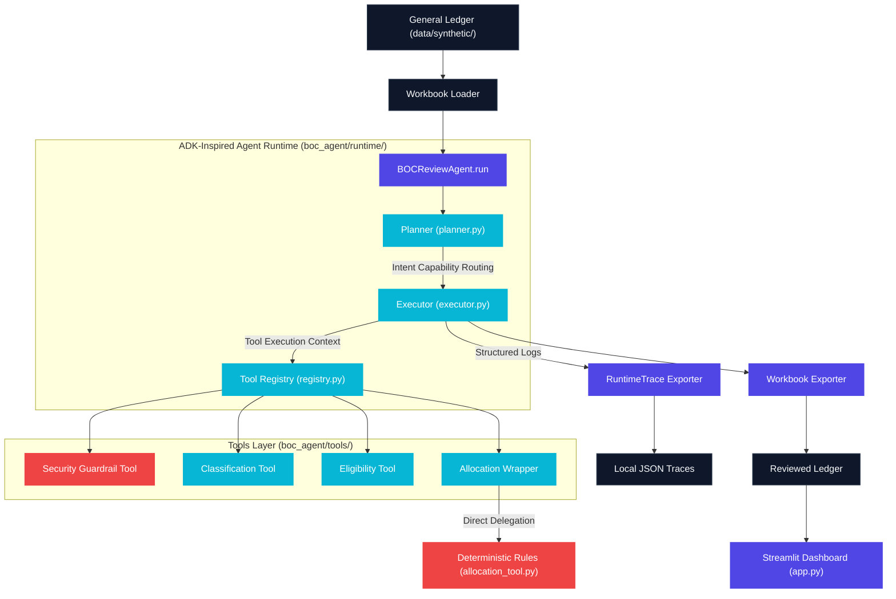

# Architecture Diagram Guide

This document details the recommended structure, visual styles, and Mermaid diagram code for representing the decoupled ADK-inspired agent runtime architecture.

---

## 🗺️ Mermaid Diagram Code

You can render the core architecture flow directly in markdown using the following code block:

---

## 🎨 Visual Style Design Recommendations

For presentations, portfolios, or external layout editors:

### draw.io Setup
- **Theme**: Dark Mode.
- **Node Colors**: Slate Grey (`#1E293B`) for boxes, with borders matching HSL tailored Indigo (`#6366F1`) and HSL tailored Cyan (`#06B6D4`).
- **Connection Style**: Orthogonal curved lines with `1pt` thickness, using cyan fill arrows to represent logic transitions.
- **Font**: Use **Helvetica** or **Inter** at `11pt` or `12pt`.

### Excalidraw Styling
- **Stroke**: Hand-drawn style with Medium roughness to give a friendly, sketch-based developer prototype aesthetic.
- **Fill**: Light translucent fill patterns (e.g. crosshatch for database/files, solid tint for primary orchestrator nodes).
- **Font**: Hand-drawn standard or Code font for variables and filenames.
- **Color Palette**: Dark Slate background with glowing pastel blue and indigo strokes.
