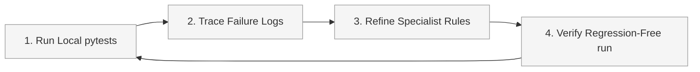

# Evaluation & Quality Flywheel Plan

This document details the evaluation strategy, validation metrics, and the quality flywheel process to benchmark the **BOC Allocation Review Agent**.

---

## 1. Ground-Truth Dataset Strategy

The validation strategy utilizes a manually labeled subset of the synthetic GL workbook. 
- **Dataset Size**: Approximately 190+ fully fictional transactions.
- **Coverage**: Fictional general ledger rows modeling Canadian film production accounting workflows for both Ontario (Ontario Creates CPTC/OFTTC) and Quebec (SODEC) application contexts.
- **Workbook Properties**: Includes Application Province, Location, Ep code, vendor/payee structure, employee/loan-out data, tax ID placeholders, address fields, currency, and transaction descriptions.
- **Review Cases Included**:
  * Missing required fields (missing province, missing address, missing Location, missing Ep, missing employee, missing tax ID).
  * Special vendor cases (e.g. `VICE STUDIO CANADA` labor cases, partnership vendor structures).
  * Standard expense categories (e.g. out-of-Canada expenses, meal/catering/craft/per diem lines, multi-share creative contracts, and payroll fringes).

A subset of these synthetic transactions will be manually labeled by a domain expert (mocked) to compile the evaluation ground truth. Note that Form 6 generation is completely out of scope, and the validation applies strictly to the internal BOC allocation review workbook outputs. The expected outputs in the validation set include:
- `Expected Allocation Column`
- `Expected Amount Percentage`
- `Expected Eligibility Status`
- `Expected Review Status`
- `Expected Secondary Allocation Note` (if applicable)

---

## 2. Evaluation Metrics

The agent is evaluated locally using the following practical metrics:

* **Allocation Column Accuracy**:
  $$\text{Allocation Accuracy} = \frac{\text{Transactions with Correct Suggested Allocation}}{\text{Total Validation Transactions}}$$
* **Eligibility Status Accuracy**:
  $$\text{Eligibility Accuracy} = \frac{\text{Transactions with Correct Eligibility Status}}{\text{Total Validation Transactions}}$$
* **Review Flag Recall**:
  $$\text{Recall}_{\text{Review}} = \frac{\text{Ambiguous or Missing-Field Rows Correctly Flagged as Needs Review}}{\text{Total Validation Rows Requiring Review}}$$
  *Ensures that rows with missing required columns (Location, Address, Tax ID, Ep) are always flagged.*
* **Ineligible Leakage Rate**:
  $$\text{Leakage Rate} = \frac{\text{Ineligible Transactions Marked Approved}}{\text{Total Ineligible Validation Transactions}}$$
  *Measures false approvals of ineligible expenses. Crucial for auditing integrity.*
* **VICE Canada Case Accuracy**:
  - Evaluation of the agent's ability to direct labor transactions with vendor `VICE STUDIO CANADA` to the specific VICE Canada allocation columns (Ontario or Federal) rather than generic labor buckets. For Quebec context, since a dedicated VICE Quebec bucket is not implemented, the evaluator checks correct mapping to `Quebec qualified labour` and the presence of the warning note.
* **Partnership Case Accuracy**:
  - Validates correct identification of partnership vendor payroll structures.
* **Meal/Catering Case Accuracy**:
  - Validates correct mapping to the meals/catering allocation bucket.
* **Multi-share Percentage Accuracy**:
  - Measures classification accuracy on complex multi-share split percentages (e.g. 65% eligible caps) and the presence of correct secondary notes.
* **Human Review Rate**:
  - Percentage of total transactions marked `Needs Human Review` by the agent.
* **Override Rate on Reviewed Sample**:
  - Percentage of agent-flagged rows where the suggested fields require correction during human audit.

---

## 3. Success Criteria (Capstone Targets)

To validate the agent's feasibility for the Kaggle Capstone presentation, the following baseline targets are established:

* **Allocation Column Accuracy**: $\ge 85\%$ on the labeled validation sample.
* **Review Flag Recall**: **100%** recall for any transaction records that contain missing required fields (missing Address, Location, Ep, or Tax ID).
* **Ineligible Leakage Rate**: **0%** critical ineligible auto-approval cases in the demo set (all ineligible entries must either be correctly marked as ineligible or flagged for review).
* **Average Latency**: $< 2$ seconds per transaction during local batch evaluation.

---

## 4. The Quality Flywheel Process

We will utilize a local-first Quality Flywheel development loop to iteratively improve the agent's rules and prompts:

1. **Run Local pytests**: Execute the test suite comparing the agent's spreadsheet export against the hand-labeled validation subset.
2. **Trace Failure Logs**: For any row mismatch (e.g. incorrect allocation column or amount percentage), review the agent's `Reasoning` and step-by-step specialist tools context.
3. **Refine Specialist Rules**: Modify mapping logic, prompt templates, or regex matches inside the Classification, Eligibility, and Allocation Tools.
4. **Verify Regression-Free Run**: Run the entire validation set to verify the error is resolved and no new classification errors were introduced in other rows.
